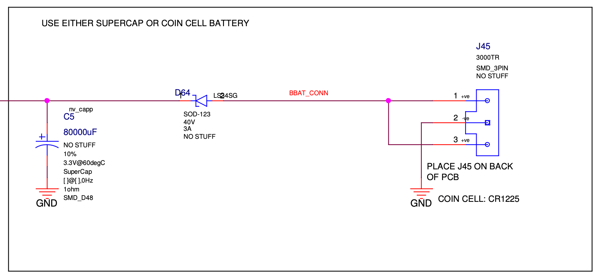
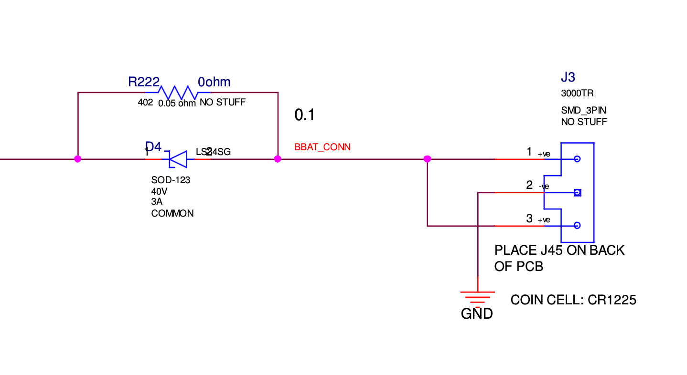

# Jetson SuperCap (Super Capacitor) RTC Details
NVIDIA Jetson Nano &amp; Jetson Xavier NX SuperCap (Super Capacitor) RTC Instructions

This is a basic set of details for connecting a SuperCapacitor to the Jetson Nano and Jetson Xavier NX platforms for use as an RTC backup source.  Use at your own risk.  This isn't meant to be a complete tutorial and using these directions will likely void any warranties and you could blow something up if you aren't careful.  I'm not your mom so do what you want.

This is meant to be used with the developer kits from NVIDIA:
- https://developer.nvidia.com/embedded/jetson-nano-developer-kit
- https://developer.nvidia.com/embedded/jetson-xavier-nx-devkit

The following SuperCapacitors from Maxwell were used:
- https://www.digikey.com/product-detail/en/maxwell-technologies-inc/BCAP0005-P300-X11/1182-1057-ND/9948923
- Datasheet for those is here: https://media.digikey.com/pdf/Data%20Sheets/Maxwell%20Tech%20PDFs/BCAP0005_P300_X11.pdf

These capacitors have a maximum voltage of 3V and are 5Farads in capacity.  Other alternatives could be used but results are based on these.

# Jetson Nano
Details below apply to the NVIDIA Jetson Nano.

## Circuit Diagram:

## Changes:
 - The diode (Dn) is not present on the Nano and can instead just be jumpered.
 - The location for the supercap on the board can be ignored and we can solder leads directly to the RTC pads.

## Before:

## After:

# Jetson Xavier NX
Details below apply to the NVIDIA Jetson Xavier NX.

## Circuit Diagram:

## Changes:
 - The diode (D4) is present on the Xavier NX and should be removed to reduce leakage current.
 - The resistor (R122) is not present but can be jumpered with a small amount of solder (Alternative: jumper the pads for D4 after removing it).
 - There is no location available for a supercap so the RTC battery pads will be used.

## Before:

## After:

# Testing Results
    Xavier NX - 5F/3V Maxwell Cap (Diode Removed)
    Fully Charged: 2.999V
    (Connected to the network.)
    >ubuntu@xavierNX:~$ timedatectl 
    >Local time: Tue 2020-06-16 08:17:42 EDT
    >Universal time: Tue 2020-06-16 12:17:42 UTC
    >RTC time: Tue 2020-06-16 12:17:43
    >Time zone: America/New_York (EDT, -0400)
    >System clock synchronized: yes
    >systemd-timesyncd.service active: yes
    >RTC in local TZ: no

    Testing results:
    (Disconnected from the network and power)
    8:19am - 2.999V
    12:13pm - 2.965V
    24 hours
    9:33am - 2.875V
    48 hours
    10:18am - 2.795V
    3:55pm - 2.781V
    72 hours
    10:29am - 2.734V
    96 hours
    8:35am - 2.681V
    Plugging back into power and getting time locally (no network)
    Local time is currently 8:37am (this is correct).
    Timedatectl command shows everything to be accurate and in sync as before.

# Links and quoted details
